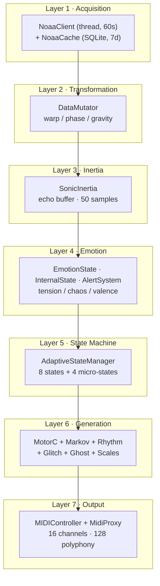

# System Architecture

> **Heliosonic Sonifier V18.5** — Real-time NOAA solar wind sonification engine.
> 25 modules · ~18,450 LOC · 7-layer pipeline · 20 Hz operation.

---

## 7-Layer Pipeline

The system processes space weather data through seven sequential layers,
operating at **20 Hz** (50 ms frame budget).

### Layer Architecture

| Layer | Module(s)                               | Responsibility                                                                 |
|-------|-------------------------------------------|---------------------------------------------------------------------------------|
| 1     | NoaaClient + NoaaCache                    | Fetch NOAA/SWPC data (60s intervals), SQLite persistence (7-day retention), offline fallback chain: live → 1h cache → 1d cache → local file → simulation |
| 2     | DataMutator                               | Black-hole data mutation: warp, phase shift, gravity inversion, spaghettification, accretion disk modulation, singularity collapse |
| 3     | SonicInertia                              | Magnetic echo buffer (50 samples), dark matter/energy metaphors, gravitational wave ripples, Hubble damping |
| 4     | EmotionState + InternalState + AlertSystem| Affective computing (tension/chaos/valence), breath/energy cycles, NOAA R/S/G alert scales, cosmic radiation events |
| 5     | AdaptiveStateManager                       | 8-state FSM with 4 micro-states, ADSR crossfade (200–500 ms), adaptive hysteresis, state prediction, transition learning |
| 6     | MotorC + generators                        | Central orchestrator: Markov melody, rhythm engine, glitch engine, ghost notes, unusual scales, preset management |
| 7     | MIDIController + MidiProxy                 | 16-channel MIDI output, 128-note polyphony, batch mode, per-channel polyphony limits, release envelopes, CC automation |

### Module Inventory (25 Modules)

| #  | Module                 | LOC   | Responsibility                                                                                           | Complexity |
|----|------------------------|-------|-----------------------------------------------------------------------------------------------------------|------------|
| 1  | MotorC                 | 2,450 | Central orchestrator: phrase scheduling, drones, performance effects, musical mapper integration          | Very High  |
| 2  | StateAwareMarkovMelody | 2,100 | 3rd-order Markov + solar physics + generative AI (genetic algorithms, Perlin noise, cellular automata)   | Very High  |
| 3  | AdaptiveStateManager   | 1,890 | 8-state FSM, crossfade, ADSR envelopes, adaptive hysteresis, prediction, transition learning              | Very High  |
| 4  | DataMutator            | 1,800 | Black-hole mutation: event horizon, singularity, spaghettification, accretion disk                        | High       |
| 5  | GlitchEngine           | 1,650 | Quantum glitches: 28 types, tunneling, entanglement, superposition, solar physics glitches                | High       |
| 6  | AdaptiveMemory         | 1,450 | Reinforcement learning: 1,000 entries, RBF ensemble (5 models), dynamic learning rate                     | High       |
| 7  | ControlSidebar         | 1,350 | Qt6 interface: sliders, NOAA panel, MIDI activity, system status, presets                                 | Medium     |
| 8  | SolarVisualWidget      | 1,200 | OpenGL solar rendering: particles, CME waves, magnetic rings, AI monitor overlay                          | Medium     |
| 9  | MidiProxy              | 950   | Thread-safe MIDI proxy: batch mode, polyphony limits, release envelopes, high-priority queue              | Medium     |
| 10 | NOAAState              | 850   | Data container: gradients, spikes, moving averages, cross-correlation, normalization with cache           | Medium     |
| 11 | MIDIController         | 780   | MIDI output: 16 channels, CC mapping, helioseismic modulation, voice management                           | Medium     |
| 12 | RhythmEngine           | 720   | Tempo, meter, swing, polyrhythm, Chandrasekhar-limit collapse, rhythmic memory                            | High       |
| 13 | GhostNoteGenerator     | 680   | Quantum ghost notes: virtual particles, uncertainty, Casimir effect, entanglement                         | Medium     |
| 14 | AlertSystem            | 650   | NOAA R/S/G alerts + cosmic radiation events (gamma-ray, Cherenkov, ultra-high-energy)                     | Medium     |
| 15 | HeliosonicApp          | 600   | Main window: initialization, keyboard/joystick handling, update loop                                      | Medium     |
| 16 | SonicInertia           | 580   | Magnetic echo, dark matter/energy metaphors, gravitational wave modulation                                | Medium     |
| 17 | UnusualScales          | 550   | 20+ scales, weighted selection, scale LFO, smooth transitions                                             | Medium     |
| 18 | NoaaClient             | 490   | API fetching, retry/backoff, offline fallback, adaptive polling, simulation mode                          | Medium     |
| 19 | NoaaCache              | 280   | SQLite cache: 7-day retention, metadata, LRU memory cache                                                 | Low        |
| 20 | EmotionState           | 120   | Affective computing: tension, chaos, valence                                                              | Low        |
| 21 | InternalState          | 90    | Breath cycle, energy smoothing                                                                            | Low        |
| 22 | HelioseismicModulator  | —     | P-mode/g-mode pitch & timing modulation, sunspot note drops (<2%)                                         | Medium     |
| 23 | PerformanceControls    | —     | Live performance effects: 14 triggers, cooldown management, visual feedback                               | Medium     |
| 24 | JoystickInput          | —     | T.Flight Stick X: 4 axes, 12 buttons, hat, calibration, auto-reconnect                                    | Medium     |
| 25 | JoystickModulator      | —     | Joystick → musical mapping: 4 axis mappings, 12 button actions, hat shifts                                | Medium     |

Data Flow Detail
Layer 1 — Acquisition

NOAA/SWPC APIs (60s intervals)
  ├── plasma-1-day.json        → speed, density
  ├── propagated-solar-wind    → Bz, speed, density
  ├── integral-protons-3-day   → proton flux
  ├── integral-electrons-3-day → electron flux
  └── noaa-scales.json         → R/S/G alerts

Fallback chain:
  live API → 1h cache → 1d cache → local JSON → simulation

NoaaClient runs in a dedicated thread with adaptive polling.
After 10 consecutive failures, it switches to simulation mode
(realistic synthetic data with storm events, Bz crossings, and proton spikes).
NoaaCache persists all data points to SQLite with quality scores
and source labels (api, online, local, simulation).

### Layer 2 — Transformation (DataMutator)

The DataMutator applies a **black-hole physics metaphor** to data mutation.

| Concept          | Musical Effect                                           |
|------------------|----------------------------------------------------------|
| Event Horizon    | When warp + scramble + resonance > 0.85, data collapses  |
| Singularity      | Complete parameter reset with chaos explosion            |
| Spaghettification| Extreme pitch stretching near the singularity            |
| Accretion Disk   | Chaotic orbital modulation during high activity          |
| Gravity Inversion| Register inversion with LFO modulation                   |

**Parameters mutated:**  
`warp_factor`, `phase_shift`, `data_scramble`, `bz_disrupt`,  
`chaos_inject`, `resonance_feedback`, `gravity_invert`.

### Layer 3 — Inertia (SonicInertia)

Applies cosmological metaphors to magnetic echo processing.

| Concept            | Implementation                                           |
|--------------------|-----------------------------------------------------------|
| Dark Matter        | Increases effective mass → longer echo decay              |
| Dark Energy        | Accelerates echo decay (cosmic expansion)                 |
| Gravitational Waves| LIGO-inspired ripples modulating the Bz field             |
| Hubble Damping     | Exponential decay based on cosmic time                    |

**Echo buffer:** 50 samples  
**Output:** processed Bz, inertia state, echo intensity

### Layer 4 — Emotion

Three sub-modules compute the affective state:

| Module        | Outputs                                                                 |
|---------------|--------------------------------------------------------------------------|
| EmotionState  | tension (from Bz + Kp), chaos (from protons + electrons + gradients), valence |
| InternalState | energy (storm × emotion), breath (sinusoidal cycle, 0.05–0.5 Hz)         |
| AlertSystem   | R/S/G scales (0–5), cosmic events (gamma-ray burst, Cherenkov, ultra-high-energy) |

### Layer 5 — State Machine (AdaptiveStateManager)

**8 Musical States**

| State           | Character                                                   |
|-----------------|--------------------------------------------------------------|
| RHYTHMIC        | Percussive, short notes, fast tempo (120–180 BPM)            |
| MELODIC         | Expressive melody, wide intervals, mid register              |
| SUSTAINED       | Long drones, slow tempo (40–80 BPM), atmospheric             |
| GLITCH          | Chaos, glitches, short notes, extreme jumps                  |
| SILENCE         | Musical silence, inaudible notes, long duration              |
| DRONE           | Stable drones, mid-register, minimal movement                |
| PULSING         | Rhythmic pulse, short notes, repetition                      |
| SOLAR_RESONANCE | Extreme solar activity, maximum chaos                        |

**4 Micro-States:** CALM · NEUTRAL · INTENSE · SOLAR_PEAK

---

### Transition Features

- **ADSR crossfade envelopes:** 200–500 ms per state  
- **Adaptive hysteresis:** 0.08–0.20 threshold, oscillation detection  
- **State prediction:** gradient-based, 0.5 s horizon  
- **Transition learning:** success/failure tracking, matrix adjustment  
- **Max transitions:** 12 per minute

### Layer 6 — Generation

MotorC orchestrates all generators:

| Generator              | Role                                               |
|------------------------|----------------------------------------------------|
| StateAwareMarkovMelody | Melodic voice (3rd-order Markov + generative AI)  |
| RhythmEngine           | Tempo, meter, swing, polyrhythm, Chandrasekhar collapse |
| GlitchEngine           | 28 glitch types with quantum + solar physics       |
| GhostNoteGenerator     | Virtual particle ghost notes                       |
| UnusualScales          | 20+ scales with weighted selection and LFO         |
| PresetManager          | 80+ presets across 6 categories                    |

### Layer 7 — Output

**MIDIController** maps voice types to 16 MIDI channels.

**MidiProxy** provides thread-safe output with:

- Batch mode (10 ms interval, 200‑message queue)  
- Per‑channel polyphony limits  
- Release envelopes (voice‑type‑specific decay)  
- High‑priority queue for note‑on / note‑off  
- MIDI clock output (24 PPQN)

See `04-MIDI-OUTPUT.md` for full channel and CC mapping.

### Performance Budget

| Metric                     | Value    | Target    | Status |
|----------------------------|----------|-----------|--------|
| Average frame time         | 8.34 ms  | < 10 ms   | ✅     |
| P95 frame time             | 12.34 ms | < 15 ms   | ✅     |
| NOAA → MIDI latency (mean) | 245 ms   | < 300 ms  | ✅     |
| NOAA → MIDI latency (p95)  | 345 ms   | < 500 ms  | ✅     |
| MIDI clock jitter          | 0.29 ms  | < 0.5 ms  | ✅     |
| Peak notes/second          | 47       | > 30      | ✅     |
| Glitch drop rate           | 0.3%     | < 1%      | ✅     |
| Memory usage (peak)        | 189 MB   | < 200 MB  | ✅     |
| CPU usage (typical)        | 15–25%   | < 30%     | ✅     |

### Technology Stack

| Layer        | Technology              | Language      |
|--------------|--------------------------|---------------|
| Python       | Python 3.9+              | Python        |
| GUI          | PySide6 (Qt6)            | Python        |
| Visualization| PyOpenGL + OpenGL        | Python / GLSL |
| MIDI I/O     | mido + python-rtmidi     | Python        |
| HTTP         | requests                 | Python        |
| Database     | SQLite3                  | SQL           |
| Input        | pygame (joystick)        | Python        |
| Optional     | numpy, scipy, numba, psutil | Python    |

Documentation only.  
Source code is proprietary and not distributed.

See `03-AI-SYSTEMS.md` for AI deep-dive.

  
