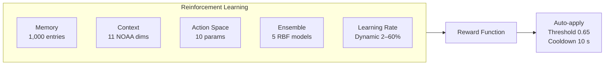

---

## 📄 File 2: `docs/03-AI-SYSTEMS.md`

```markdown
# AI Systems

> Deep-dive into the five intelligent systems that drive
> the Heliosonic Sonifier's autonomous musical behaviour.

---

## Overview

The Heliosonic Sonifier implements the **AI-Chimera** framework through
20 autonomous agents operating across the 7-layer pipeline.
The four primary AI systems are:

| System | Module | Role |
|--------|--------|------|
| **Markov Melody** | `StateAwareMarkovMelody` V8.0 | Generative melody with solar physics |
| **Reinforcement Learning** | `AdaptiveMemory` V3.4 | Autonomous parameter adaptation |
| **Quantum Glitch Engine** | `GlitchEngine` V8.1 | Quantum-inspired glitch generation |
| **Adaptive State Manager** | `AdaptiveStateManager` V7.0 | 8-state FSM with prediction |

Supporting systems: `GhostNoteGenerator` (quantum ghost notes),
`GenerativeMelodyGenerator` (genetic algorithms + Perlin + cellular automata).

---

## 1. StateAwareMarkovMelody (V8.0)

### Architecture

| Property | Value |
|----------|-------|
| **Order** | 3rd |
| **States** | 8 musical states |
| **Transitions** | ~80,000 possible |
| **Contours** | stepwise, ascending, descending, arch |
| **Cache** | LRU (200 entries, 95% hit rate) |
| **Prediction** | O(k) with k ≤ 10, 3 ms typical, 12 ms worst-case |

### Generative AI Layer

The Markov chain is augmented by a **GenerativeMelodyGenerator** that
produces melodies neither purely deterministic nor entirely random:

| Technique | Implementation |
|-----------|----------------|
| **Genetic Algorithms** | Population of 20 patterns, 5% mutation rate, 70% crossover rate, tournament selection |
| **Perlin Noise** | 4-octave continuous variation for texture |
| **Cellular Automata** | Rule 30 for rhythmic pattern generation |
| **Weighted Blending** | Markov (60%) + Genetic (30%) + Perlin (10%) |

### Solar Physics Integration

The melody "breathes" with the Sun's oscillation modes:

| Mode | Frequency | Period | Musical Effect |
|------|-----------|--------|----------------|
| **p-modes** | 3 mHz | ~333 s | Pitch modulation (vibrato), contour shaping |
| **g-modes** | 200 μHz | ~5,000 s | Slow temporal modulation, breath pattern |
| **Solar cycle** | ~11 years | — | Long-form structural change |

**Solar Resonance Melody:** When solar intensity exceeds 0.8,
the system enters a resonance state where melodies are generated
directly from p-mode and g-mode phase relationships, modulated
by Fibonacci-based harmonic intervals.

**Fractal Solar Patterns:** Patterns generated using the Wolf number
(sunspot count) with recursive fractal depth 2–5.

### State-Dependent Parameters

| State | Interval Range | Repeat Prob | Pitch Range | Duration | Breath Pattern |
|-------|:--------------:|:-----------:|:-----------:|:--------:|:--------------:|
| RHYTHMIC | −5 to +7 | 20% | 48–86 | 2.5–7.0 s | pulsing |
| MELODIC | −9 to +10 | 12% | 52–90 | 4.0–14.0 s | sustained |
| SUSTAINED | −4 to +5 | 30% | 38–74 | 8.0–45.0 s | swelling |
| GLITCH | −14 to +15 | 45% | 45–98 | 2.0–6.0 s | chaotic |
| SILENCE | 0 | 100% | 0–25 | 10–3600 s | sustained |
| DRONE | −2 to +2 | 60% | 36–72 | 15–60 s | drone |
| PULSING | −6 to +8 | 35% | 50–85 | 3.0–10.0 s | pulsing |

---

## 2. AdaptiveMemory — Reinforcement Learning (V3.4)

### Architecture



### Episodic Memory

| Property            | Value                                   |
|---------------------|-------------------------------------------|
| Capacity            | 1,000 entries                             |
| Context dimensions  | 11 NOAA parameters                        |
| Action dimensions   | 10 musical parameters                     |
| Similarity          | RBF kernel, O(D × N) = 11 × 1,000 = 11k ops |
| Confidence          | Per-entry, decay 0.995/s                  |
| Gradient weights    | Per-entry, NOAA-gradient-adaptive         |

**Context Vector (11 dims):**  
bz, speed, protons, electrons, kp, density,  
bz_gradient, speed_gradient, protons_gradient, storm, tension

**Action Space (10 params):**  
chaos, density, register, glitch, tempo,  
warp, phase, resonance, p_mode, g_mode

### Ensemble Models

Five models with independent hyperparameters, weighted by prediction accuracy:

| Model Parameter   | Range     |
|-------------------|-----------|
| Learning rate     | 0.05–0.15 |
| Similarity sigma  | 0.15–0.25 |
| Decay factor      | 0.90–0.98 |
| Exploration       | 0.05–0.15 |

Weights updated every **60 seconds** based on prediction error.

### Dynamic Learning Rate

The learning rate adapts to context (replacing the fixed 0.12):

| Condition                                           | Learning Rate | Rationale                    |
|-----------------------------------------------------|---------------|-------------------------------|
| Calm data (Bz < 2, speed < 500, protons < 10)       | 2–3%          | Avoid learning noise          |
| Normal operation                                    | 5–15%         | Standard adaptation           |
| AI stuck in GLITCH (> 75% recent decisions)         | 50–60%        | Force exploration             |
| Curiosity boost (state visited < 5%)                | ≥ 40%         | Explore rare states           |
| Low confidence                                      | Up to 80%     | Needs more learning           |


### Reward Function

R = 0.25(1 − T) + 0.20E + 0.20C_opt + 0.20N + 0.15S

### Reward Function — Symbols

| Symbol | Meaning               |
|--------|------------------------|
| T      | Tension (lower is better) |
| E      | Energy                |
| C_opt  | Chaotic optimality    |
| N      | Note diversity        |
| S      | State stability       |

### Auto‑Apply System

| Parameter   | Value                         |
|-------------|-------------------------------|
| Threshold   | 0.65 confidence               |
| Cooldown    | 10 seconds                    |
| Modulation  | Internal LFO (sine, 1.5 Hz, depth 0.15) |
| Targets     | chaos, glitch, warp, phase, density, tempo |

### Sequence Memory

The system stores **parameter sequences** (up to 8 steps, 1.5 s interval)  
and can **recall them** when a similar NOAA context is detected.

### Glitch Types (28 Total)

#### Standard Glitches (24)

| Type            | Effect                          |
|-----------------|----------------------------------|
| interval_jump   | Random interval displacement     |
| ghost_note      | Low-velocity shadow note         |
| note_inversion  | Octave inversion                 |
| rhythm_shift    | Duration displacement            |
| scale_break     | Scale deviation                  |
| cluster_bomb    | Velocity burst                   |
| harmonic_shift  | Harmonic interval shift          |
| velocity_spike  | Velocity multiplication          |
| chord_burst     | Chord velocity spread            |
| silent_gap      | Note suppression                 |
| glitch_drone    | Sustained glitch drone           |
| granular_pulse  | Granular micro-pulse             |
| echo_cloud      | Multi-tap echo cloud             |
| pitch_glide     | Pitch glide                      |
| harmonic_ring   | Harmonic ring                    |
| octave_jump     | Octave displacement              |
| tempo_ramp      | Tempo acceleration/deceleration  |
| lfo_wobble      | LFO pitch wobble                 |
| delay_echo      | Delay echo                       |
| ring_mod        | Ring modulation                  |
| wavefold        | Wavefolding                      |
| bit_reduction   | Bit depth reduction              |
| phase_shift     | Phase displacement               |
| fm_burst        | FM burst                         |

---

### Solar Physics Glitches (4)

| Type            | Trigger               | Effect                                           |
|-----------------|------------------------|--------------------------------------------------|
| solar_resonance | Solar intensity > 0.9 | Pitch shift + velocity boost + duration extension |
| p_mode_pulse    | p-mode > 0.5          | Pitch modulation at p-mode frequency             |
| g_mode_drone    | g-mode > 0.5          | Long drone with g-mode modulation                |
| sunspot_burst   | sunspot > 0.4         | Chaotic pitch + velocity burst                   |

---

### Quantum Mechanics (Computational Metaphor)

⚠️ These are computational metaphors, **not quantum simulations**.

| Concept       | Implementation                               |
|---------------|-----------------------------------------------|
| Tunneling     | P = exp(−2κL), barrier 0.5–0.9                |
| Entanglement  | Coupled ghost notes, coherence length ξ = 0.5 |
| Superposition | 4 collapsed states from probability amplitudes |
| Throttling    | —                                             |

---

### Throttling Limits

| Parameter               | Limit |
|-------------------------|-------|
| Max glitches/second     | 10    |
| Max simultaneous glitches | 3    |
| Glitch probability cap  | 0.85  |
| Soft cap (> 0.6)        | Excess halved |

### State Transition Matrix

- Base **8×8** transition matrix  
- NOAA-driven bias  
- Emergency matrix (storm/alert override)  
- Micro-state matrix **4×4**

### Crossfade System — ADSR per State

| State           | Attack | Decay | Sustain | Release |
|-----------------|--------|-------|---------|---------|
| RHYTHMIC        | 50 ms  | 100 ms| 0.80    | 150 ms  |
| MELODIC         | 100 ms | 150 ms| 0.70    | 200 ms  |
| SUSTAINED       | 200 ms | 200 ms| 0.60    | 300 ms  |
| GLITCH          | 20 ms  | 50 ms | 0.90    | 50 ms   |
| SILENCE         | 300 ms | 300 ms| 0.50    | 400 ms  |
| DRONE           | 150 ms | 100 ms| 0.80    | 350 ms  |
| PULSING         | 30 ms  | 80 ms | 0.75    | 150 ms  |
| SOLAR_RESONANCE | 250 ms | 200 ms| 0.65    | 500 ms  |

### Adaptive Hysteresis

- Base threshold: **0.12**
- Adaptive range: **0.08–0.20**
- Oscillation detection: direction changes in 2‑second window
- When oscillation detected: threshold × **1.3** (max 0.20)
- Recovery: threshold × **0.95** per cycle

### State Prediction

Gradient-based prediction with **0.5 s horizon**:

- Computes chaos, tension, and storm gradients  
- Projects values forward  
- Applies decision rules to predicted values  
- Requires **3 consecutive consistent predictions** before acting  
- **2‑second cooldown** between predictions

### Transition Learning

- Tracks success/failure per (from_state → to_state) pair  
- Success ratio > 0.6 → probability × **1.05**  
- Success ratio < 0.4 → probability × **0.95**  
- Exponential decay **0.95** on all memory entries

### Quantum Concepts Applied
⚠️ Computational metaphors, not physics simulations.

| Concept               | Implementation                               |
|-----------------------|-----------------------------------------------|
| Heisenberg Uncertainty| Δx·Δp ≥ ħ/2 → probability modulation          |
| Virtual Particles     | 6 types: photon, gluon, W boson, Z boson, graviton, Higgs |
| Casimir Effect        | Attraction/repulsion between virtual particles |
| Tunneling             | Ghost notes “tunnel” through rhythmic barriers |
| Entanglement          | Correlated ghost note pairs                   |
| Superposition         | Ghost note exists in multiple states until observed |

### Particle Type Selection

| Musical State | Particle Type | Rationale                     |
|---------------|---------------|-------------------------------|
| GLITCH        | Gluon         | Strong force (chaotic)        |
| MELODIC       | Photon        | Electromagnetism (harmonious) |
| SUSTAINED     | Graviton      | Gravity (constant)            |
| RHYTHMIC      | W Boson       | Decay (rhythmic)              |
| Other         | Higgs         | Mass (foundation)             |

### AI-Chimera Framework
The Heliosonic Sonifier is grounded in the AI-Chimera ontogenetic
architecture, defined as a dynamic quintuple:

X = {B, M, A, E, Be}

### Component Model

| Component | Meaning                                                        |
|-----------|----------------------------------------------------------------|
| B (Body)  | Operational materiality (MIDI, OpenGL, Qt)                     |
| M (Metabolism) | Interpretative transduction layer (DataMutator)          |
| A (Environment) | Ontological condition of existence (NOAA data)          |
| E (States) | Internal configurations of tension and transitional potential |
| Be (Emergent Behaviour) | Dynamic manifestation of all components         |


Intelligence is defined operationally as differential sensitivity:

I = ∂Be / ∂A

Documentation only. Source code is proprietary and not distributed.
See 02-ARCHITECTURE.md for system overview.
