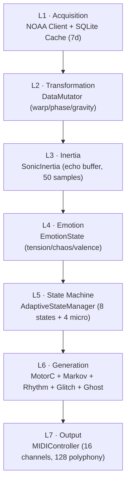

<p align="center">
  
</p>

<h1 align="center"> Heliosonic Sonifier</h1>

<p align="center">
  <b>Real-time NOAA solar wind sonification with AI, reinforcement learning,<br>
  and a quantum-inspired glitch engine. Transforms space weather into adaptive MIDI music.</b>
</p>

<p align="center">
  <i>Hugo Paquete & DeepSeek AI · INET-md, University of Aveiro · 2026</i>
</p>

<p align="center">
  <a href="LICENSE"></a>
  
  
  
  
  
</p>

## Academic Context

The **Heliosonic Sonifier** is a research-creation instrument developed within the
project ***AI as Catalyst: Transformative Impacts on Digital Performance,
Computational Music, and Cultural Creativity***
([FCT 2024.09158.CEECIND](https://www.inetmd.pt/projetos-inet/ai-as-catalyst-impactos-transformadores-na-performance-digital-musica-computacional-e-criatividade-cultural/),
2026–2029), of which **Hugo Paquete** is Principal Investigator.

The project's central thesis is that **AI functions as a catalyst** — not a
replacement — for human creativity, transforming digital performance,
computational music, and cultural creativity. The Heliosonic Sonifier
operationalizes this thesis by positioning AI as an **autonomous co-agent**
that *resonates* with environmental data rather than merely representing it.

### Research Goals Addressed

| AI as Catalyst Goal | Heliosonic Contribution |
|---------------------|--------------------------|
| AI transforming digital performance | Real-time human–AI co-performance via joystick, hardware controllers, and autonomous AI adaptation |
| AI transforming computational music | Generative melody (3rd-order Markov + genetic algorithms), RL-driven parameter adaptation |
| AI transforming cultural creativity | Scientific metaphors (helioseismology, black holes, quantum mechanics) as compositional constraints |

---

## Overview

The **Heliosonic Sonifier** is a real-time artistic sonification instrument that
transforms **NOAA/SWPC space-weather data** into adaptive MIDI music. It bridges
scientific data and musical expression through generative AI and computational
creativity, serving as a platform for live performance and data exploration.

> [!IMPORTANT]
> This is a **documentation-only** repository. It presents the system's
> architecture, design, and research context. The source code and executables
> are proprietary and are **not distributed** here.

| Attribute | Value |
|-----------|-------|
| **Version** | 18.5 |
| **Scale** | ~18,450 LOC · 25 modules · 20 autonomous agents |
| **Pipeline** | 7 layers · 20 Hz real-time (50 ms frame budget) |
| **Output** | MIDI + CC · 16 channels · 128-note polyphony |
| **Platform** | Windows 10/11 |
| **Funding** | FCT 2024.09158.CEECIND · CEEC-FCT 2026-HELIOSONIC |

### Key Innovations

- **State-aware Markov chains** — 3rd-order, 8 musical states, ~80,000 transitions
- **Reinforcement learning** — 1,000-entry episodic memory, dynamic learning rate (2–60%)
- **Quantum-inspired glitch engine** — tunneling, entanglement, superposition (metaphor)
- **Black-hole data mutation** — artistic metaphor for data transformation
- **Helioseismic modulation** — p-modes (3 mHz, verified) and g-modes (theoretical)
- **Chandrasekhar-limit rhythm collapse** — stellar physics applied to rhythm

---

## Documentation

The full documentation lives in [`docs/`](docs/). Start with the overview, then
dive into any subsystem.

| # | Document | Contents |
|:-:|----------|----------|
| 01 | [Overview](docs/01-OVERVIEW.md) | Mission, pipeline, research positioning |
| 02 | [Architecture](docs/02-ARCHITECTURE.md) | 7-layer pipeline, 25-module inventory |
| 03 | [AI Systems](docs/03-AI-SYSTEMS.md) | Markov, reinforcement learning, quantum glitch |
| 04 | [MIDI Output](docs/04-MIDI-OUTPUT.md) | 16 channels, CCs, polyphony limits |
| 05 | [Hardware](docs/05-HARDWARE.md) | 16/12-key controllers + joystick mappings |
| 06 | [Data Mapping](docs/06-DATA-MAPPING.md) | NOAA → music, 1:N transduction paradigm |
| 07 | [Performance](docs/07-PERFORMANCE.md) | Benchmarks, mapping accuracy, diversity |
| 08 | [Scientific Transparency](docs/08-SCIENTIFIC-TRANSPARENCY.md) | Verified / theoretical / artistic models |

---

## Key innovations

- **State-aware Markov chains** — 3rd-order, 8 musical states, ~80,000 transitions
- **Reinforcement learning** — 1,000-entry episodic memory, dynamic learning rate
- **Quantum-inspired glitch engine** — tunneling, entanglement, superposition
- **Black-hole data mutation** — artistic metaphor for data transformation
- **Helioseismic modulation** — p-modes (3 mHz) and theoretical g-modes
- **Chandrasekhar-limit rhythm collapse** — stellar physics applied to rhythm
- **Custom hardware controllers** — 16-key, 12-key, and joystick

---

## Architecture

### 7-layer pipeline


### Core Modules (Selection)

| Module                 | LOC   | Responsibility                 |
|------------------------|-------|--------------------------------|
| MotorC                 | 2,450 | Central orchestrator           |
| StateAwareMarkovMelody | 2,100 | 3rd-order Markov generation    |
| AdaptiveStateManager   | 1,890 | 8-state FSM with crossfade     |
| DataMutator            | 1,800 | Black-hole data mutation       |
| GlitchEngine           | 1,650 | Quantum-inspired glitches      |
| AdaptiveMemory         | 1,450 | Reinforcement learning         |
| ControlSidebar         | 1,350 | Qt6 interface + NOAA panel     |
| SolarVisualWidget      | 1,200 | OpenGL visualization           |
| RhythmEngine           | 720   | Tempo + polyrhythm + collapse  |
| GhostNoteGenerator     | 680   | Quantum ghost notes            |

→ Full detail: `docs/02-ARCHITECTURE.md`

### AI Systems

| System                 | Description                                                                 |
|------------------------|-----------------------------------------------------------------------------|
| StateAwareMarkovMelody | 3rd-order Markov, 8 states, LRU cache (200 entries, 95% hit rate), genetic algorithms + Perlin noise |
| AdaptiveMemory         | RL with 1,000 entries × (11 NOAA dims × 10 music dims), ensemble of 5 RBF models, dynamic learning rate |
| GlitchEngine           | 28 glitch types, throttled to 10/s and 3 simultaneous                       |
| AdaptiveStateManager   | 8 states + 4 micro-states, 200–500 ms crossfade, adaptive hysteresis        |
| HelioseismicModulator  | p-mode/g-mode pitch & timing modulation                                     |

#### Reward Function

R = 0.25(1−T) + 0.20E + 0.20C_opt + 0.20N + 0.15S  
(T = tension · E = energy · C_opt = chaotic optimality · N = note diversity · S = state stability)

→ Full detail: `docs/03-AI-SYSTEMS.md`

### Data Sources → Music

| NOAA Parameter      | Range            | Musical Mapping                     |
|---------------------|------------------|-------------------------------------|
| Bz (IMF)            | −20 … +20 nT     | Register, tension, scale            |
| Solar wind speed    | 200–1000 km/s    | Tempo (BPM), rhythm density         |
| Proton flux         | 0–500 pfu        | Glitch intensity, chaos             |
| Electron flux       | 0–5000 pfu       | Texture, ambient density            |
| Kp index            | 0–9              | Chaos level, state transition       |
| Alerts (R/S/G)      | 0–5              | Emergency states, glitch burst      |

→ Full detail: `docs/06-DATA-MAPPING.md`

### Musical Output

**16 MIDI channels · 128-note polyphony**

| CH | Voice        | CH | Voice         |
|----|--------------|----|---------------|
| 1  | Drone bass   | 9  | Pulse         |
| 2  | Drone mid    | 10 | Harmonic      |
| 3  | Drone high   | 11 | Texture       |
| 4  | Melody       | 12 | FX            |
| 5  | Glitch       | 13 | Recalled      |
| 6  | Chord        | 14 | Silence       |
| 7  | Ambient      | 15 | Visible CCs   |
| 8  | Rhythm       | 16 | Internal CCs  |

### Control Change Messages (Channel 15)

Chaos (20) · Density (21) · Register (22) · Glitch (23) · Tension (24) ·  
Storm (25) · Bz (26) · Speed (27) · p-mode (70) · g-mode (71) · Sunspot (72)

→ Full detail: `docs/04-MIDI-OUTPUT.md`

## 🖼️ Gallery

### Software

<p align="center">
  
</p>

<p align="center">
  
</p>

### Hardware Prototypes

<p align="center">
  
  <br>
  <em>Hand-built research prototypes — HS-16 (left) · HS-12 (right)</em>
</p>

Demo video
🚧 Coming soon — a full performance demonstration will be added here.
<!-- When ready, replace with:
<p align="center">
<a href="https://www.youtube.com/watch?v=YOUR_VIDEO_ID">

</a>
</p>
-->

### Performance

| Metric                       | Value   | Target   | Status |
|------------------------------|---------|----------|--------|
| Avg frame time               | 8.34 ms | < 10 ms  | ✅     |
| P95 frame time               | 12.34 ms| < 15 ms  | ✅     |
| NOAA → MIDI latency (mean)   | 245 ms  | < 300 ms | ✅     |
| NOAA → MIDI latency (p95)    | 345 ms  | < 500 ms | ✅     |
| MIDI clock jitter            | 0.29 ms | < 0.5 ms | ✅     |
| Peak notes/second            | 47      | > 30     | ✅     |
| Glitch drop rate             | 0.3%    | < 1%     | ✅     |

**Mapping accuracy:** 97.0% overall ✅

→ Full detail: `docs/07-PERFORMANCE.md`

### Scientific Transparency — A Computer Music Perspective

The Heliosonic Sonifier employs scientific concepts not as simulations but as **generative constraints** and **compositional heuristics** — a practice well-established in computer music discourse. As I have articulated in the AI as Catalyst research framework, the system operates through a distinction between:

- **Representation**: Data is translated into sound through 1:1 mapping; the composer controls the mapping.
- **Resonance**: Data is metabolized by the system through 1:N transduction; the composer curates emergence.

This distinction is fundamental to understanding why the scientific references in the Heliosonic Sonifier are metaphorical rather than literal. The system does not ask: *"What does a p-mode sound like?"* It asks: *"How does a p-mode reorganize the internal state of the computational organism?"* — a formulation grounded in the AI-Chimera's ontogenetic architecture:

X = {B, M, A, E, Be}


Where **Body** = operational materiality, **Metabolism** = interpretative transduction, **Environment** = ontological condition, **States** = internal tensions, and **Emergent Behavior** = dynamic manifestation.

| Model | Status | Role in Heliosonic Sonifier | Application |
|-------|--------|----------------------------|-------------|
| **p-modes (helioseismic)** | ✅ VERIFIED | Pitch modulation (vibrato) at 3 mHz (333s period) | StateAwareMarkovMelody breathes with solar oscillations |
| **g-modes (helioseismic)** | ⚠️ THEORETICAL | Slow temporal modulation (~5000s period) | Artistic speculation — not empirically confirmed |
| **Solar cycle (11 years)** | ✅ VERIFIED | Long-form structural change | Temporal scaffolding for large-scale musical evolution |
| **Black hole analogies** | 🎨 ARTISTIC METAPHOR | Data transformation thresholds, reset mechanisms | Event horizon → warp+scramble triggers singularity |
| **Quantum mechanics** | 🎨 ARTISTIC METAPHOR | Probabilistic decision-making, coupled ghost notes | Tunneling, entanglement, superposition as generative constraints |

**Status Legend:**
- ✅ **VERIFIED** = Scientifically established; used as structural inspiration
- ⚠️ **THEORETICAL** = Hypothetical, not confirmed; used as artistic speculation
- 🎨 **ARTISTIC METAPHOR** = Computational metaphor; not a scientific simulation

### The Computer Music Tradition of Scientific Metaphor

This approach participates in a distinguished tradition within computer music — what French composer Jean-Claude Risset termed *"the poetic appropriation of scientific models"*:

| Composer/Researcher | Scientific Reference | Musical Application |
|---------------------|----------------------|---------------------|
| **Iannis Xenakis** (1971) | Stochastic physics, gas theory | Probability-based composition |
| **Curtis Roads** (2001) | Particle physics | Granular synthesis paradigm |
| **Miller Puckette** (1996) | State machines | Real-time control architecture |
| **Hugo Paquete** (2026) | Quantum mechanics, black hole physics | 1:N transduction, probabilistic collapse, generative constraints |

### The Resonant Framework

The Heliosonic Sonifier operationalizes what I term **digital resonance** — the phenomenon in which a computational system's internal states oscillate at specific frequencies in response to environmental forcing, producing emergent behaviors through algorithmic coupling rather than representational mapping.

This is formalized as:

d²S/dt² + Γ·dS/dt + Ω²·S = F(A(t))


Where:
- **S(t)** = The system's sonic state vector (MIDI parameters)
- **Γ** = The damping matrix (emotional decay)
- **Ω** = The natural frequency matrix (CALM, TENSE, STORM, CHAOS)
- **F(A(t))** = The environmental forcing function (NOAA data)

### Why This Matters

The system is an **artistic and educational tool**, not a scientific simulation.

1. **Operationalizing scientific concepts as compositional constraints** — generating musical material through algorithmic resonances
2. **Cultivating meta-listening** — a reflexive auditory practice that interrogates the conditions under which listening is mediated, governed, and automated
3. **Contributing to sonic infrastructuralism** — a practice of infrastructural critique through vibrational modulation

As I have argued in my recent work:

> "The shift from representation to resonance — from translation to transduction — is the theoretical and practical contribution of this research. The system does not ask: *'What sound corresponds to this data point?'* It asks: *'How does this data pattern reorganize the internal state of the computational organism?'*"

### Critical Reflection

The use of scientific metaphor in computer music is not without risks. When I describe the system's "quantum collapse," I refer to a specific computational process — probabilistic selection from a set of latent states — not to a mysterious or inexplicable phenomenon. The metaphor should illuminate, not obscure.

The Heliosonic Sonifier's scientific transparency is therefore not an afterthought but an integral part of the work — a form of what I term **meta-listening** applied to the system's own architecture.

---

*This project is part of the research project "AI as Catalyst: Transformative Impacts on Digital Performance, Computational Music, and Cultural Creativity" (FCT 2024.09158.CEECIND).*

### Research Ecosystem

Part of the **AI as Catalyst** research programme  
(FCT 2024.09158.CEECIND · 2026–2029), extending the AEROSONIC framework into the heliospheric domain:

- **AEROSONIC SONIFIER** — atmospheric data sonification  
- **HELIOSONIC SONIFIER** — solar / heliospheric data sonification  
- **CYBER ATTACK SONIFIER** — cybersecurity threat sonification  
- **GLITCH ECOLOGY** — ecological data sonification  

Developed with **INET-md / University of Aveiro**, in collaboration with:  
Absonus Lab · Planetário do Porto – CCV · OTTOsonics


## Citation

If you use this work, please cite it (see [`CITATION.cff`](CITATION.cff)):

```bibtex
@software{Paquete2026Heliosonic,
  author  = {Hugo Paquete and DeepSeek AI},
  title   = {Heliosonic Sonifier: NOAA Solar Wind Sonification},
  year    = {2026},
  version = {18.5},
  url     = {https://github.com/hugopaquete/heliosonic},
  note    = {Funded by FCT (2024.09158.CEECIND) - AI as Catalyst}
}
```

---

## Author & Affiliations

**Hugo Paquete** — Principal Investigator

| Profile | Link |
|---------|------|
| ORCID | [0000-0002-5844-3678](https://orcid.org/0000-0002-5844-3678) |
| Ciência Vitae | [C818-547A-287C](https://www.cienciavitae.pt/portal/C818-547A-287C) |
| Google Scholar | [Profile](https://scholar.google.com/citations?user=knPFLG4AAAAJ) |
| ResearchGate | [Profile](https://www.researchgate.net/profile/Hugo-Paquete) |
| Website | [hugopaquete.com](https://hugopaquete.com/) |

**Affiliations**

- [INET-md, University of Aveiro](https://www.inetmd.pt/equipa/hugo-paquete/)
- [Absonus Lab](https://absonuslab.org)
- [Sensoria Lab (UBI)](https://iartes.ubi.pt/laboratorios/sensoria)
- [Biofeedback Art Research](https://biofeedbackartresearch.net/members/paquete/)
- [UP enrede](https://www.up.pt/enrede/alfa/hugo-paquete/)

---

## Funding

This work is funded by national funds through **FCT — Fundação para a Ciência e
a Tecnologia** within the scope of:

- **2024.09158.CEECIND** — *AI as Catalyst: Transformative Impacts on Digital
  Performance, Computational Music, and Cultural Creativity* (2026–2029)
- **CEEC-FCT grant No. 2026-HELIOSONIC**


## License

**GNU General Public License v3.0** — © 2026 Hugo Paquete. All rights reserved.

- ✅ Permitted: academic research, artistic creation, education
- ❌ Prohibited: commercial use without permission, reverse engineering, AI training without permission

---

## Contact

- **Email / Website:** [hugopaquete.com](https://hugopaquete.com/)
- **GitHub:** [@hugopaquete](https://github.com/hugopaquete)
- **Institution:** INET-md, University of Aveiro
